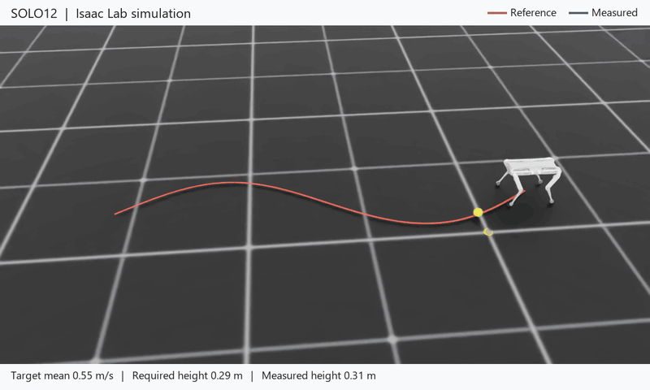
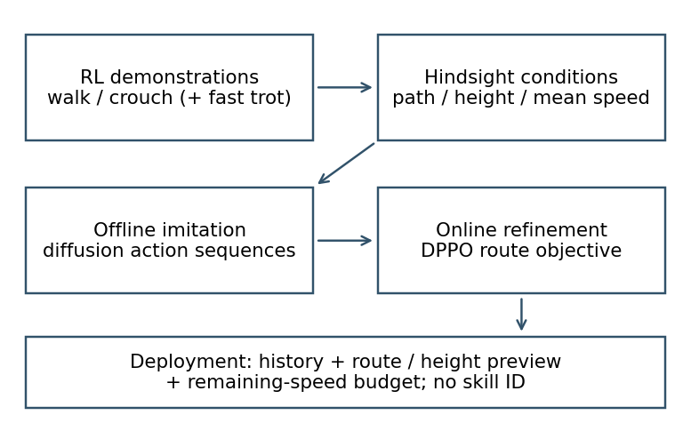
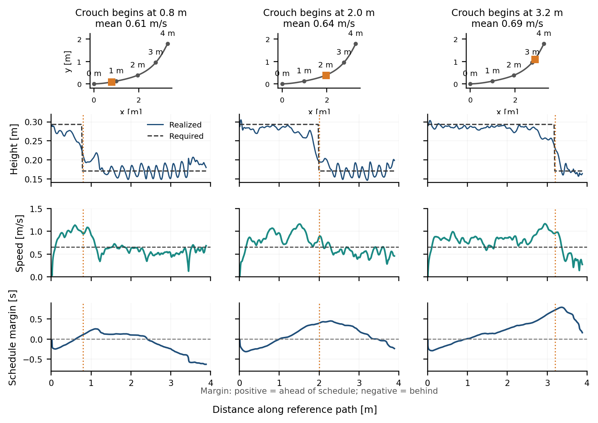
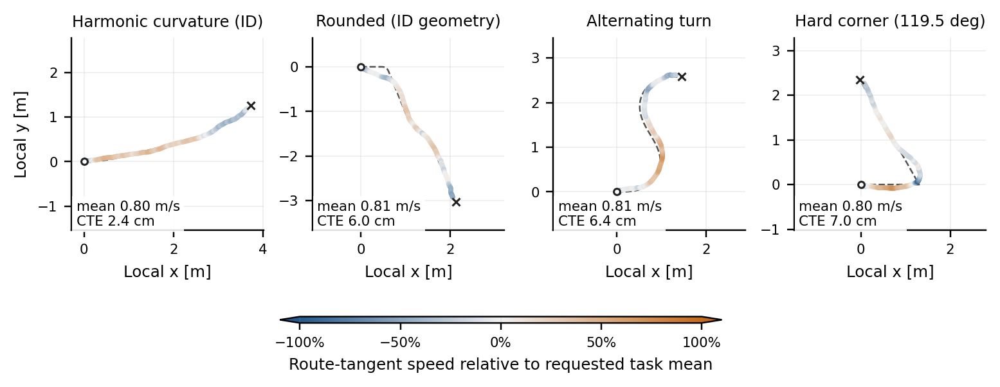
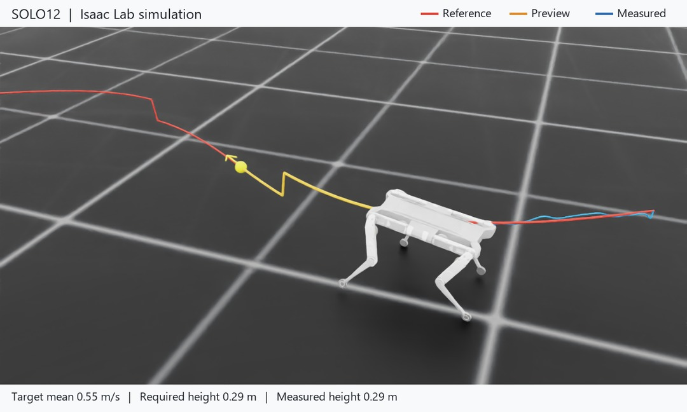
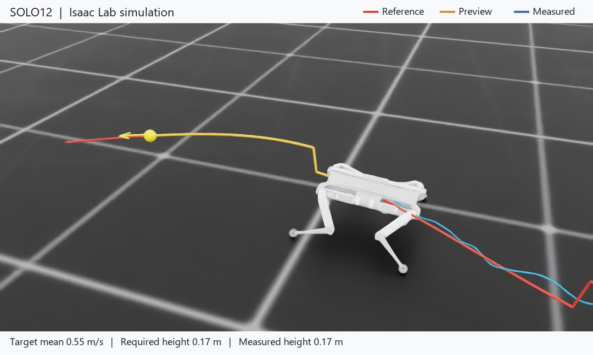
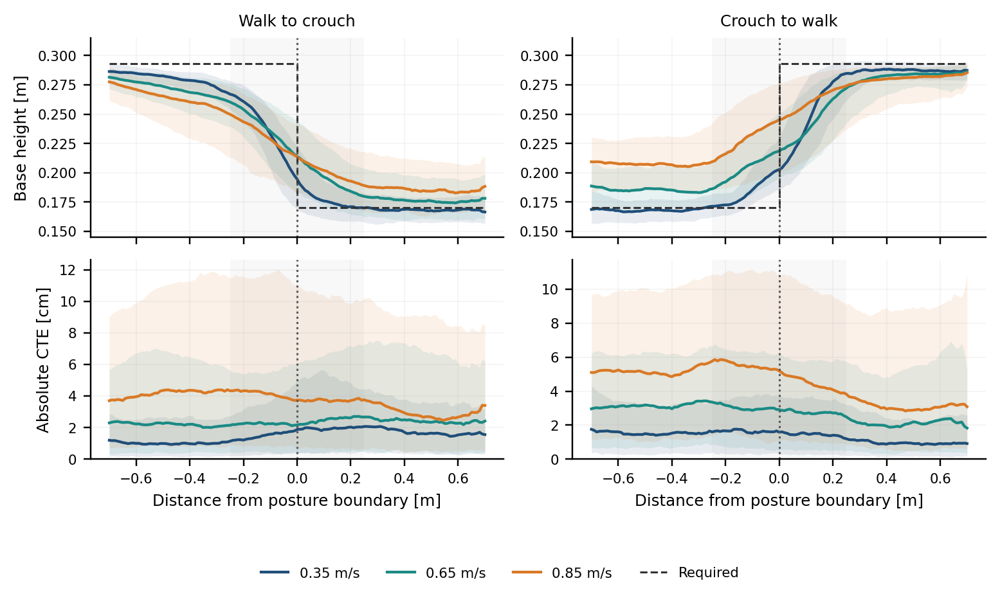

# Diffusion Policies for Path-Conditioned Quadruped Locomotion

Research on learning-based locomotion for the **SOLO12 quadruped** at **IRI (CSIC–UPC)**.

The controller receives a route, a body-height profile and a target average speed. It learns from trajectories generated by existing velocity-controlled RL experts: hindsight relabelling turns their achieved motion into spatial and temporal conditioning, and Diffusion Policy Policy Optimization (DPPO) refines the resulting imitation policy to complete the task. No gait identifier is supplied at inference.

[Method and design decisions](docs/project/method.md) · [Results and limitations](docs/project/results.md) · [Training, evaluation and demos](docs/project/running.md) · [Figure provenance](docs/project/figures/README.md)

*A live policy rollout in Isaac Lab: WC-DPPO follows a 4 m curved reference with walk→crouch→walk height requirements and a requested mean of 0.55 m/s. The clean viewer preset retains the native coordinates: red is the 3D reference at the required height, orange the upcoming segment, blue the measured base trace, and yellow the future target with its yaw arrow. The GIF shows the active traverse at simulated speed—not hardware or a wall-clock real-time demonstration. [Demo details and reference](docs/project/media/README.md).*

## From existing behaviours to path-conditioned control

1. **Generate demonstrations** with pretrained locomotion experts under randomized velocity commands.
2. **Relabel achieved motion** as future route geometry, posture and average-speed conditions, without a path-conditioned expert.
3. **Train a diffusion policy offline** to generate joint-action sequences from state, action and condition history.
4. **Refine with DPPO** using route progress, tracking, posture, arrival timing and physical safety.
5. **Execute four actions, then replan.** The final controller acts on the joints directly.

The contribution is the path–posture–average-speed interface and its empirical evaluation. Diffusion supplies the action-sequence prior; hindsight relabelling and DPPO are established methods adapted to this task.

## Average speed allows different local speeds

A target average speed defines how long the route should take. It does not require the robot to maintain one instantaneous speed everywhere.

*Same route, same requested mean of 0.65 m/s, different crouch locations. The controller changes its local pace as the posture requirement moves. The last row shows accumulated timing margin: positive means ahead of a uniform schedule, negative means behind. Achieved means are 0.61, 0.64 and 0.69 m/s, so adaptation is observable but timing is not exact.*

Remaining distance and remaining target time are converted into an explicit speed-budget input. The controller learns how to respond to that feedback; this is not a claim that it discovers a clock or an optimal speed planner.

*The same controller follows different geometries at a requested mean of 0.8 m/s. Colour shows route-tangent speed relative to that mean: blue indicates slower progress and orange faster progress. These are individual diagnostic rollouts; the annotated mean speeds and cross-track errors describe those rollouts, not a population success rate.*

## Posture is specified along the route

| Standing section | Crouching section |
|:--:|:--:|
|  |  |

*Rendered close-ups of the same controller and reference. Required heights are 0.293 and 0.171 m; measured heights in these captures are 0.286 and 0.169 m. The policy receives height conditions, not a skill ID.*

*Walk-to-crouch and crouch-to-walk transitions over different route geometries. The dashed line is the required height; solid curves are medians and bands are descriptive 10th–90th percentiles. The grey region marks an existing scoring exemption around the height discontinuity. Early transitions and larger errors at high speed remain visible.*

The demonstrated heights are approximately **0.293 m standing** and **0.171 m crouching**. Reliable interpolation to arbitrary intermediate heights is not established.

## What the experiments show

Offline imitation supplies useful route-following behaviour, but does not reliably satisfy the complete arrival, posture and timing contract. Online refinement substantially improves joint completion.

A matched deterministic transformer followed by Gaussian PPO provides the non-diffusion comparison:

| Condition | Deterministic BC + Gaussian PPO | Diffusion BC + DPPO |
|---|---:|---:|
| Fast crouch → walk | 96.6 ± 1.6% | 99.4 ± 0.4% |
| Fast walk → crouch | 60.9 ± 17.9% | 99.0 ± 0.4% |
| Repeated posture changes, standing start | 6.7 ± 2.1% | 98.5 ± 2.6% |
| Repeated posture changes, crouched start | 11.9 ± 3.6% | 54.6 ± 4.6% |

*Task success, mean ± sample standard deviation across three online seeds per fixed offline prior. Fast rows use ID targets of 0.65, 0.75 and 0.85 m/s. Task success combines arrival, terminal pose, posture and average-speed checks; path-adherence results are reported separately in the [results](docs/project/results.md).*

Both refined methods solve ordinary routes well. The diffusion-based pipeline is more robust in the tested demanding compositions, while repeated crouch-start behaviour remains a clear weakness. These comparisons do not establish that diffusion is necessary, isolate denoising as the cause, or demonstrate transfer to a physical robot.

## Where to find the implementation

This repository is an Isaac Lab fork. Project code lives in a small set of directories:

| Directory | Purpose |
|---|---|
| [`scripts/diffusion_policy/`](scripts/diffusion_policy/) | Demonstration collection, hindsight conditioning, imitation training, playback and evaluation |
| [`scripts/dppo_diffusion_rl/`](scripts/dppo_diffusion_rl/) | Diffusion fine-tuning, route generators, task rewards and frozen evaluation banks |
| [`scripts/gaussian_chunk_rl/`](scripts/gaussian_chunk_rl/) | Matched deterministic BC + Gaussian PPO comparison |
| [`source/.../direct/solo12/`](source/isaaclab_tasks/isaaclab_tasks/direct/solo12/) | SOLO12 locomotion experts and task environments |
| [`docs/project/`](docs/project/) | Method, decisions, experiment interpretation and runnable commands |
| [`research_artifacts/`](research_artifacts/) | Compact result tables and figure checksums |

Start with the [running guide](docs/project/running.md). It explains the installation requirements, the offline-to-online workflow and a visual Isaac Lab demo. Datasets, model weights, raw evaluations, videos and machine-specific Slurm launchers are kept outside the public source tree.

## Scope and foundations

The current evidence is in Isaac Lab, on open 4 m routes and the evaluated geometry, speed and posture ranges. High-speed corners, intermediate heights, and reliable three-gait retention remain open. Sim2sim and robot deployment are ongoing work rather than completed results.

The approach builds on [DiffuseLoco](https://arxiv.org/abs/2404.19264), [Diffusion Policy](https://arxiv.org/abs/2303.04137), [DPPO](https://arxiv.org/abs/2409.00588) and the broader diffusion-locomotion literature, including [LocoDiff](https://arxiv.org/abs/2411.08832). Their roles in the design are explained in the [method](docs/project/method.md#foundations).

The original framework documentation is preserved in [README_ISAACLAB.md](README_ISAACLAB.md). Isaac Lab and inherited components retain their [licences](LICENSE).
