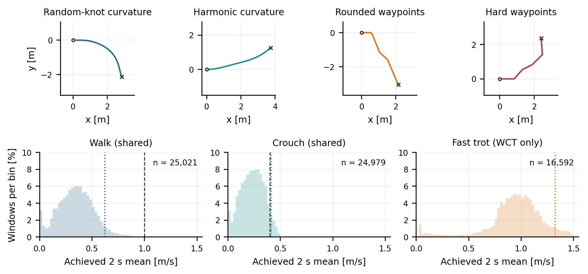

# Method and design decisions

[Overview](../../README.md) · [Results](results.md) · [Running guide](running.md)

## Research question

Can existing locomotion demonstrations support a route, spatial-posture and average-speed interface through hindsight relabelling and online refinement, without path-conditioned experts or a deployed skill identifier?

This work studies a conditioning extension for an offline diffusion locomotion prior. It is not a new diffusion architecture, a new DPPO algorithm, or a demonstration that every such task requires diffusion.

## Conditioning and execution

The policy consumes eight samples of proprioceptive, action and goal history. The evaluated height-profile representation has 16 goal dimensions:

| Component | Meaning |
|---|---|
| Four `[x, y, height]` preview tokens | Upcoming route positions in the local yaw frame and required height there |
| Current required height | Posture at current route progress |
| Terminal-yaw sine/cosine | Final relative heading without angle-wrap discontinuity |
| Speed scalar | Achieved speed during hindsight training; remaining-route speed budget during refinement |

There is no input for walk, crouch, trot or pace. Behaviour names identify data sources and evaluation conditions.

The transformer has four layers, width 128 and four heads. It predicts 16 action tokens, uses ten denoising steps, and executes four tokens beginning at offset eight before replanning. Physics runs at 200 Hz and joint targets at 50 Hz. DPPO fine-tunes five reverse transitions. These are evaluated settings, not proven globally optimal choices.

## Hindsight supervision

Experts receive randomized velocity commands. Achieved future XY motion supplies route labels; achieved arc length over the relabelling interval supplies average-speed labels. Recorded desired-height commands provide posture targets, avoiding supervision from oscillating measured height. Conditions use the local yaw frame and quadruped augmentation during imitation.

A relabelled trajectory describes what the expert accomplished. It does not automatically teach recovery from arbitrary route errors or guarantee task completion. DPPO provides subsequent task refinement.

See the [goal builder](../../scripts/diffusion_policy/train/conditioning/goal_builder.py), [dataset](../../scripts/diffusion_policy/train/data/dataset.py) and [offline config](../../scripts/diffusion_policy/train/configs/walk_crouch_hindsight_geom_profile16_a0_faithful_k10.json).

## Average speed and feedback

For route length `L` and requested mean `v*`, the target duration is `T* = L / v*`. At active elapsed time `t` and progress `s`:

```text
remaining_speed = clip((L - s) / max(T* - t, control_dt), 0, 1.5 m/s)
```

This engineered input represents timing debt and allows recovery elsewhere after slower sections. The evaluated actor keeps geometric preview based on nominal requested mean; the final scalar carries remaining-speed feedback. A later experiment changing both preview and speed support was not adopted as the primary recipe.

The learned part is how to act under that feedback, rather than discovering a clock or proving optimal time allocation.

## Route and posture sampling



The online sampler draws open 4 m routes from four components with equal marginal probability:

| Visible family | Internal name | Mechanism |
|---|---|---|
| Random-knot curvature | `procedural` | Integrate linearly interpolated random curvature |
| Harmonic curvature | `coherent_smooth` | Biased and sinusoidal curvature |
| Rounded waypoints | `rounded_waypoint` | Random segments with smooth corner realizations |
| Hard waypoints | `hard_waypoint` | Random segments with discontinuous heading changes |

Internal names remain for checkpoint compatibility. The families overlap; they are not disjoint classes or a universal distribution over paths.

Posture profiles are native constants and both transition directions, with boundaries at 0.8–3.2 m. Native heights are approximately 0.2932 and 0.1705 m.

A conservative envelope screens deadlines using assumed local support of 0.4 m/s for crouch, 0.6 m/s for demanding turns and 1.2 m/s for open sections. These are sampling assumptions, not local speed commands or mechanical limits. The historical sampler couples some directions and transition contexts, restricting generalization claims.

## Task objective

The reward combines progress, bounded robust path/height/yaw costs, schedule-error improvement, terminal pose and outcome costs. Progress weighting avoids rewarding additional episode duration as useful locomotion. There is no gait phase, foot-pair pattern or instantaneous target-speed reward in the refined path controller.

The primary recipe uses path weight 2.0, profile-height weight 0.75, a 10 cm distance-weighted CTE training gate, and zero reference-KL coefficient. Exact terms are in [rewards.py](../../scripts/dppo_diffusion_rl/rewards.py); [commands](running.md#online-diffusion-refinement) pin the settings. Archived evaluation success differs from training success; [results](results.md#what-success-means) distinguish task success and adherence.

## Why these choices

| Decision | Reason | Qualification |
|---|---|---|
| Reuse velocity experts | Existing locomotion provides achieved-motion supervision | Demonstrations do not teach every recovery or transition |
| Use diffusion action sequences | Follow an established approach to heterogeneous offline locomotion | Diffusion is not shown necessary or universally better |
| Hindsight rather than path-conditioned experts | Label the motion already available | Labels remain bounded by demonstrated support |
| Refine the joint-action policy | Adapt the existing path-conditioned prior to the coupled task | This does not refute hierarchical control generally |
| Average-speed budget | Permit varying local pace while accounting for time | Feedback is engineered; allocation is not proven optimal |
| Several route mechanisms | Include smooth curvature and waypoint turns without a finite catalogue | Weights and ranges are design assumptions |
| Paired frozen references | Compare actors on identical geometries | More conditions do not create more independent routes |
| Deterministic BC + Gaussian PPO | Competent comparison with the same transformer and task | Priors and optimizers differ; compute and offline seeds are not matched |

WC uses walk/crouch demonstrations. WCT adds fast trot; the tested recipe did not explain superior fast capability, and its data amount, mixture and offline updates differ. An exploratory pace experiment aims to supply slow demonstrations while reusing walk for fast motion. Pace acquisition remains unvalidated and is not a completed main result.

## Foundations

- [DiffuseLoco](https://arxiv.org/abs/2404.19264): offline multi-skill locomotion, delayed inputs and receding-horizon execution; the main locomotion motivation.
- [Diffusion Policy](https://arxiv.org/abs/2303.04137): action-sequence denoising and the transformer policy formulation.
- [DPPO](https://arxiv.org/abs/2409.00588): online optimization through diffusion denoising transitions.
- [LocoDiff](https://arxiv.org/abs/2411.08832): related offline diffusion-locomotion adaptation; its classifier-free guidance is not used here.
- [Isaac Lab](https://github.com/isaac-sim/IsaacLab): simulation, robot/task interfaces and accelerated training inherited by this fork.

These sources motivate the components. The project-specific conditioning, task construction and evaluated integration are the subject of this research.
