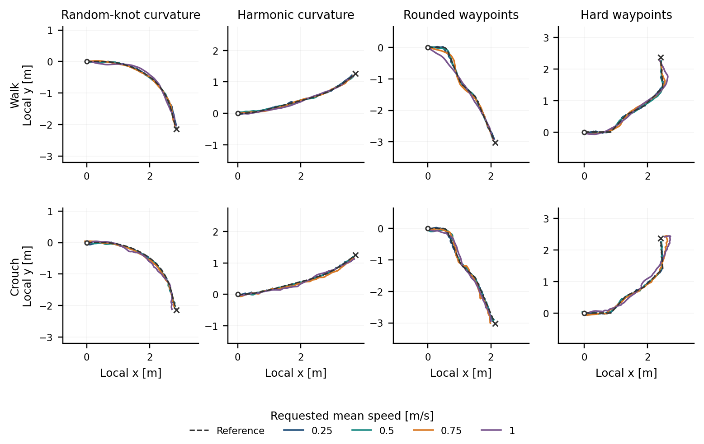
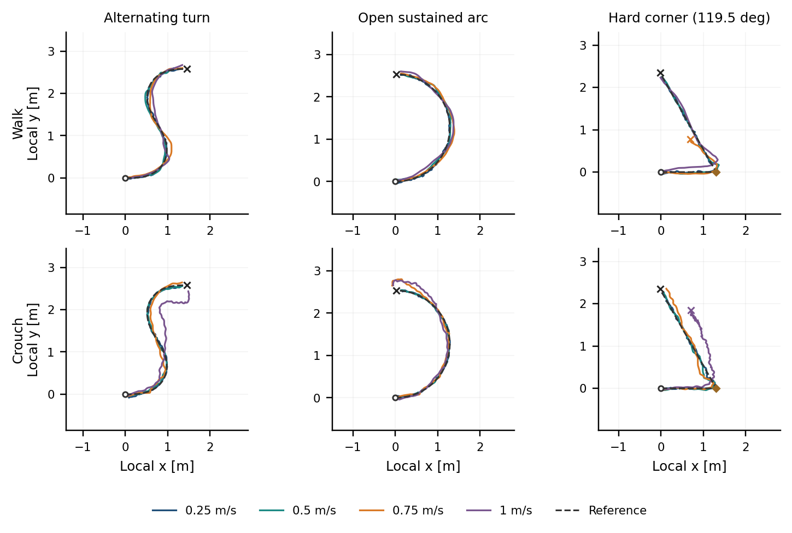

# Results and limitations

[Overview](../../README.md) · [Method](method.md) · [Running guide](running.md)

These tables and figures are a snapshot of the research manuscript. They are simulation evidence, not an accepted publication or a real-robot validation.

## What success means

Archived task success combines:

| Requirement | Evaluation threshold |
|---|---:|
| Terminal position error | ≤ 0.15 m |
| Terminal yaw error | ≤ 0.40 rad |
| Terminal height error | ≤ 0.05 m |
| First-arrival mean-speed error | ≤ 0.08 m/s |
| Profile-height MAE | ≤ 0.04 m |

Height scoring excludes 0.25 m around each posture discontinuity; the displayed traces retain those regions. Success on two native heights does not establish intermediate-height accuracy.

**Adherence success** adds active time-weighted cross-track-error RMSE ≤0.10 m. This is not a maximum-error bound or an exact replay of the distance-weighted training gate.

First-arrival mean speed is active route distance divided by arrival time, rather than mean body-frame velocity. Failed attempts remain in rate denominators; arrival-speed errors condition on arrival. Safety until first arrival and over the full horizon are separate quantities.

## Offline imitation and online refinement

| ID suite | Controller | Adherence success | Active safety | Mean active CTE RMSE |
|---|---|---:|---:|---:|
| Constant posture | Deterministic BC | 0.0% | 79.2% | 3.8 cm |
| Constant posture | Diffusion BC | 2.8% | 85.0% | 3.3 cm |
| Constant posture | Diffusion BC + DPPO | 100.0 ± 0.0% | 100.0 ± 0.0% | 1.9 ± 0.5 cm |
| Single transition | Deterministic BC | 0.0% | 67.2% | 5.4 cm |
| Single transition | Diffusion BC | 0.6% | 84.5% | 3.5 cm |
| Single transition | Diffusion BC + DPPO | 99.9 ± 0.1% | 100.0 ± 0.0% | 2.1 ± 0.5 cm |

BC rows have one offline seed. DPPO rows report mean ± sample standard deviation across three online seeds from one fixed diffusion prior. Low strict success shows that imitation does not reliably solve the coupled task before refinement.

## Matched Gaussian PPO comparison

The deterministic control uses the same transformer, conditions, action chunk and execution horizon, trained with action regression. Gaussian PPO refines its mean under the same route task and nominal interaction budget. It is not PPO from scratch.

| Condition | Deterministic BC + Gaussian PPO | Diffusion BC + DPPO |
|---|---:|---:|
| Fast ID crouch → walk | 96.6 ± 1.6% | 99.4 ± 0.4% |
| Fast ID walk → crouch | 60.9 ± 17.9% | 99.0 ± 0.4% |
| Fast stress crouch → walk | 90.4 ± 4.4% | 99.1 ± 1.0% |
| Fast stress walk → crouch | 48.9 ± 17.6% | 98.0 ± 0.7% |
| Repeated profile, standing start | 6.7 ± 2.1% | 98.5 ± 2.6% |
| Repeated profile, crouched start | 11.9 ± 3.6% | 54.6 ± 4.6% |

Archived task success, mean ± sample SD over three online seeds per fixed prior. Fast ID targets are 0.65/0.75/0.85 m/s; stress targets are 0.65/0.85. Repeated profiles contain four switches spaced 0.8 m apart.

Gaussian PPO solves ordinary routes very well. DPPO is more robust in these demanding compositions, particularly walk-to-crouch and repeated standing-start profiles. Distinct priors and optimization procedures prevent attributing the difference solely to denoising. Three online seeds do not measure offline-prior variability.

## Geometric tracking

Colours are requested mean speeds, not actual instantaneous velocities. Endpoint arrival in these illustrations does not imply passing posture and timing checks. High crouch requests exceed supported training speeds.

These illustrations use an alternating turn, an open sustained arc and a 119.5-degree heading change, with the same target grid for both postures. Coloured endpoint crosses denote nonarrival. Some historically named “OOD” routes overlap training support; these examples are not a population estimate.

## Posture and temporal behaviour

The medians aggregate transitions across geometries. Bands are descriptive 10th–90th percentiles, not confidence intervals. Faster targets produce earlier height changes and larger errors; anticipation alone does not establish correct posture everywhere.

The request is 0.65 m/s in all columns; achieved means are 0.61/0.64/0.69. Margin is `route_progress / requested_mean - active_elapsed_time`. Positive means ahead of uniform pace, negative behind. It is cumulative, so a robot may remain ahead while slowing.

A scalar-only intervention provides additional evidence:

| Remaining-speed input | Arrival | Adherence success | Arrival-speed MAE |
|---|---:|---:|---:|
| Normal feedback | 95.8% | 91.0% | 2.04 cm/s |
| Fixed target | 93.1% | 81.2% | 3.63 cm/s |
| Permuted target | 94.4% | 29.2% | 17.87 cm/s |

WC seed 42, 24 paired geometries, 144 attempts per mode. Only the final scalar changes; normal geometric preview is retained. This tests usefulness of the trained input, not superiority over a separately trained controller without time conditioning.

## Limits of the evidence

- Open 4 m routes, finite speed ranges and principally two native heights.
- High-speed hard corners and intermediate-height tracking remain difficult.
- Repeated crouch-start composition is still a clear weakness.
- Faster motion does not establish flying-trot reproduction or three-gait retention.
- WC/WCT compares unequal dataset recipes, not an equal-data causal gait intervention.
- Sampling envelopes, mixture weights and transition contexts are engineering assumptions.
- A sealed holdout, runtime measurements, sim2sim and robot tests remain before stronger deployment claims.

The [machine-readable snapshot](../../research_artifacts/paper_snapshot/results.json) and [figure provenance](figures/README.md) retain the metric definitions and source checksums.
